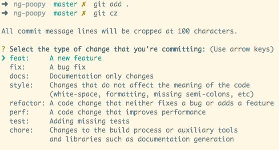

# Naming cheatsheet

- [Git commitizen](#git-commitizen)
- [Sematic Release](#sematic-release)

---

Git commit, flow and control the code is hard. Will be harder when we want to release a new version. So We need to have some rules and some tools to help project is more clearly to maintain and innovate. Let start with the good things bellow. 

## git-commitizen

When you commit with Commitizen, you'll be prompted to fill out any required commit fields at commit time. No more waiting until later for a git commit hook to run and reject your commit (though that can still be helpful).
### Installing the command line tool

Installation is as simple as running the following command (if you see EACCES error, reading fixing npm permissions may help):

``npm install -g commitizen``

### Start to commit 

Simply use `git cz` or just `cz` instead of `git commit` when committing. You can also use `git-cz`, which is an alias for `cz`.

```sh 
/* Bad */
git commit -m 'Your message'

/* Good */
git cz 
```
When you run `git cz`, it will show to you some options to choose. Based on your changes. Select the right stage to commit your changes.




## sematic-release

### Commit message format

**semantic-release** uses the commit messages to determine the consumer impact of changes in the codebase.
Following formalized conventions for commit messages, **semantic-release** automatically determines the next [semantic version](https://semver.org) number, generates a changelog and publishes the release.

By default, **semantic-release** uses [Angular Commit Message Conventions](https://github.com/angular/angular/blob/master/CONTRIBUTING.md#-commit-message-format).
The commit message format can be changed with the [`preset` or `config` options](docs/usage/configuration.md#options) of the [@semantic-release/commit-analyzer](https://github.com/semantic-release/commit-analyzer#options) and [@semantic-release/release-notes-generator](https://github.com/semantic-release/release-notes-generator#options) plugins.

Tools such as [commitizen](https://github.com/commitizen/cz-cli) or [commitlint](https://github.com/conventional-changelog/commitlint) can be used to help contributors and enforce valid commit messages.

The table below shows which commit message gets you which release type when `semantic-release` runs (using the default configuration):

| Commit message                                                                                                                                                                                   | Release type                                                                                                    |
| ------------------------------------------------------------------------------------------------------------------------------------------------------------------------------------------------ | --------------------------------------------------------------------------------------------------------------- |
| `fix(pencil): stop graphite breaking when too much pressure applied`                                                                                                                             | ~~Patch~~ Fix Release                                                                                           |
| `feat(pencil): add 'graphiteWidth' option`                                                                                                                                                       | ~~Minor~~ Feature Release                                                                                       |
| `perf(pencil): remove graphiteWidth option`<br><br>`BREAKING CHANGE: The graphiteWidth option has been removed.`<br>`The default graphite width of 10mm is always used for performance reasons.` | ~~Major~~ Breaking Release <br /> (Note that the `BREAKING CHANGE: ` token must be in the footer of the commit) |

### Automation with CI

**semantic-release** is meant to be executed on the CI environment after every successful build on the release branch.
This way no human is directly involved in the release process and the releases are guaranteed to be [unromantic and unsentimental](http://sentimentalversioning.org).

### Triggering a release

For each new commit added to one of the release branches (for example: `master`, `next`, `beta`), with `git push` or by merging a pull request or merging from another branch, a CI build is triggered and runs the `semantic-release` command to make a release if there are codebase changes since the last release that affect the package functionalities.

**semantic-release** offers various ways to control the timing, the content and the audience of published releases.
See example workflows in the following recipes:

- [Using distribution channels](docs/recipes/release-workflow/distribution-channels.md#publishing-on-distribution-channels)
- [Maintenance releases](docs/recipes/release-workflow/maintenance-releases.md#publishing-maintenance-releases)
- [Pre-releases](docs/recipes/release-workflow/pre-releases.md#publishing-pre-releases)

### Release steps

After running the tests, the command `semantic-release` will execute the following steps:

| Step              | Description                                                                                                                     |
| ----------------- | ------------------------------------------------------------------------------------------------------------------------------- |
| Verify Conditions | Verify all the conditions to proceed with the release.                                                                          |
| Get last release  | Obtain the commit corresponding to the last release by analyzing [Git tags](https://git-scm.com/book/en/v2/Git-Basics-Tagging). |
| Analyze commits   | Determine the type of release based on the commits added since the last release.                                                |
| Verify release    | Verify the release conformity.                                                                                                  |
| Generate notes    | Generate release notes for the commits added since the last release.                                                            |
| Create Git tag    | Create a Git tag corresponding to the new release version.                                                                      |
| Prepare           | Prepare the release.                                                                                                            |
| Publish           | Publish the release.                                                                                                            |
| Notify            | Notify of new releases or errors.                                                                                               |


